# 이음(ieum) 전체 ER 다이어그램 — 통합(예상) 구조

> 통합 기준: `origin/main`(e3fa15a) ⊕ 워크트리 `claude/competent-davinci-2d5c43`(JOINED 상속)
> 이 문서는 **머지 후 목표 스키마**를 4요소(키 · 컬럼명(영어) · 속성 · 설명(한글))로 정리한 ERD 레퍼런스입니다.
> 세 종류의 변경을 마커로 가시화: **① JOINED 상속**(우리, 코드 반영) + **② region 개편**(결정·미구현) + **③ origin/main 유입**(머지 시 우리 브랜치 반영).
> 그 밖의 제안/논의(시간필드 통합 등)는 → `docs/entity-model.md` 참조.

## 범례 (변경 마커)

세 종류의 변경을 **구분해서** 표시합니다.

**① 이미 반영됨(우리)** — 워크트리 코드에 적용된 User-Profile JOINED 상속 변경:

| 마커 | 의미 |
|---|---|
| `(신규)` | 새로 추가된 테이블/컬럼 |
| `(승격)` | 자식 테이블 → 부모 `profiles`로 끌어올린 공통 컬럼 |
| `(FK변경)` | PK/FK 참조 대상이 `users.id` → `profiles.user_id`로 변경 |

**② 결정·미구현** — region 모델링 개편(D1=(i)·D2=(b) 확정, **코드 미반영** · 출처 `docs/entity-model.md` §4.1/§6):

| 마커 | 의미 |
|---|---|
| `(제거예정)` | 결정에 따라 제거될 테이블/컬럼/관계 |
| `(신규예정)` | 추가될 컬럼 (주소 스냅샷) |
| `(강등예정)` | 역할 축소 (표시명 캐시) |

**③ origin/main 유입** — origin/main(e3fa15a)이 추가/변경했고 우리 브랜치가 **머지 시 흡수**(현재 우리 코드엔 미반영, 머지 충돌·컴파일 영향 없음 검증 완료):

| 마커 | 의미 |
|---|---|
| `(origin신규)` | origin/main이 추가한 테이블/컬럼 |
| `(origin변경)` | origin/main이 기존 컬럼 속성 변경 |

(마커 없음) = **변경 없음** (기존 구조 그대로)

🔶 **① 영향**: `profiles`(신규) · `user_profiles`(승격+FK변경) · `caregiver_profiles`(동일) · `users`(관계 추가).
🔻 **② 영향**: `help_requests`(region_id 제거 + 주소 스냅샷 추가) · `caregiver_service_regions`(테이블 제거) · `regions`(역할 강등).
🟦 **③ 영향**: `user_personality_tags`(신규 테이블) · `caregiver_profiles`(서비스/시간 TEXT 2컬럼) · `user_profiles`(보호자 nullable화) · `Gender`(OTHER 제거).

---

## 전체 ER 다이어그램

```mermaid
erDiagram
    %% ===== 신원/프로필 (JOINED 상속) =====
    users ||--o| profiles : "1:0..1 (ADMIN 제외)"
    profiles ||--o| user_profiles : "JOINED·USER"
    profiles ||--o| caregiver_profiles : "JOINED·CAREGIVER"

    %% ===== 이용자 속성 (M:N) =====
    user_profiles ||--o{ user_disability_types : has
    disability_types ||--o{ user_disability_types : in
    user_profiles ||--o{ user_communication_methods : has
    communication_methods ||--o{ user_communication_methods : in
    user_profiles ||--o{ user_personality_tags : "has (origin신규)"
    personality_tags ||--o{ user_personality_tags : "in (origin신규)"

    %% ===== 지원사 속성 =====
    caregiver_profiles ||--o{ caregiver_availability : has
    caregiver_profiles ||--o{ caregiver_service_regions : "serves (제거예정)"
    regions ||--o{ caregiver_service_regions : "in (제거예정)"
    caregiver_profiles ||--o{ caregiver_personality_tags : has
    personality_tags ||--o{ caregiver_personality_tags : in

    %% ===== 매칭 흐름 (백엔드 A 종축) =====
    service_categories ||--o{ help_requests : categorizes
    regions ||--o{ help_requests : "locates (제거예정)"
    user_profiles ||--o{ help_requests : requester
    help_requests ||--o{ help_request_applications : receives
    caregiver_profiles ||--o{ help_request_applications : applies
    help_requests ||--o{ help_request_personality_tags : tagged
    personality_tags ||--o{ help_request_personality_tags : in
    help_requests ||--o| reviews : "1:0..1"
    user_profiles ||--o{ reviews : author
    caregiver_profiles ||--o{ reviews : target

    %% ===== 대화 =====
    help_request_applications ||--o| conversations : "accepted 1:1"
    user_profiles ||--o{ conversations : requester
    caregiver_profiles ||--o{ conversations : caregiver
    conversations ||--o{ messages : contains
    users ||--o{ messages : sender

    users {
        bigint id PK "식별자"
        varchar email UK "이메일 (NOT NULL)"
        varchar phone UK "전화번호"
        varchar password_hash "비밀번호 해시 (NOT NULL)"
        varchar role "역할 USER/CAREGIVER/ADMIN"
        varchar status "상태 ACTIVE/PAUSED/BANNED/DELETED"
        datetime last_login_at "최근 로그인 시각"
        datetime deleted_at "삭제 시각 (soft delete)"
        datetime created_at "생성 시각"
        datetime updated_at "수정 시각"
    }

    profiles {
        bigint user_id PK,FK "사용자 ID·공유 PK → users.id (신규 테이블)"
        varchar profile_type "프로필 구분자 USER/CAREGIVER·상호배타 강제 (신규)"
        varchar full_name "이름 NOT NULL (승격)"
        date birth_date "생년월일 (승격)"
        varchar gender "성별 M/F (승격 · origin변경: OTHER 제거)"
        datetime created_at "생성 시각 (승격)"
        datetime updated_at "수정 시각 (승격)"
    }

    user_profiles {
        bigint user_id PK,FK "→ profiles.user_id (FK변경)"
        varchar guardian_name "보호자 이름 (origin변경: NOT NULL→선택)"
        varchar guardian_phone "보호자 연락처 (origin변경: NOT NULL→선택)"
        bigint region_id FK "지역 → regions.id"
        varchar address_detail "상세주소"
        varchar mobility_aid "이동 보조 기구"
        text activity_range "활동 가능 범위"
        text avoid_situations "피해야 할 상황"
        text lifestyle_note "생활 메모"
        text intro_text "자기소개"
    }

    caregiver_profiles {
        bigint user_id PK,FK "→ profiles.user_id (FK변경)"
        varchar profile_image_url "프로필 사진 URL"
        varchar intro_short "한 줄 소개"
        text intro_long "상세 소개"
        varchar availability_status "활동 상태 AVAILABLE/BUSY/OFFLINE"
        boolean has_certification "자격증 보유 여부 NOT NULL"
        varchar certification_type "자격증 종류"
        text experience "경력"
        text service_categories "가능 업무 (쉼표구분 TEXT) (origin신규)"
        text available_time_slots "가능 시간대 (쉼표구분 TEXT) (origin신규)"
        decimal avg_rating "평균 평점 0.00~5.00 NOT NULL"
        int total_reviews "완료한 도움 요청 수 NOT NULL"
    }

    disability_types {
        bigint id PK "식별자"
        varchar code UK "유형 코드 NOT NULL"
        varchar name_ko "유형명 NOT NULL"
        smallint sort_order "정렬 순서 NOT NULL"
    }

    user_disability_types {
        bigint user_id PK,FK "이용자 프로필 → user_profiles"
        bigint disability_type_id PK,FK "장애 유형 → disability_types"
    }

    communication_methods {
        bigint id PK "식별자"
        varchar name_ko UK "방식명 NOT NULL"
        smallint sort_order "정렬 순서"
    }

    user_communication_methods {
        bigint user_id PK,FK "이용자 프로필 → user_profiles"
        bigint communication_method_id PK,FK "의사소통 방식 → communication_methods"
    }

    user_personality_tags {
        bigint user_id PK,FK "이용자 프로필 → user_profiles (origin신규)"
        bigint tag_id PK,FK "성향 태그 → personality_tags (origin신규)"
    }

    personality_tags {
        bigint id PK "식별자"
        varchar name_ko UK "태그명 NOT NULL"
    }

    caregiver_availability {
        bigint caregiver_id PK,FK "지원사 프로필 → caregiver_profiles"
        smallint day_of_week PK "요일 0~6"
        time start_time PK "시작 시각"
        time end_time "종료 시각 NOT NULL"
    }

    caregiver_service_regions {
        bigint caregiver_id PK,FK "지원사 프로필 → caregiver_profiles (테이블 제거예정)"
        bigint region_id PK,FK "활동 지역 → regions (테이블 제거예정)"
    }

    caregiver_personality_tags {
        bigint caregiver_id PK,FK "지원사 프로필 → caregiver_profiles"
        bigint tag_id PK,FK "성향 태그 → personality_tags"
    }

    regions {
        bigint id PK "식별자 (역할 강등예정: 표시명 캐시)"
        varchar code UK "지역 코드 NOT NULL"
        varchar sido "시/도 NOT NULL"
        varchar sigungu "시/군/구 NOT NULL"
        varchar dong "동/읍/면"
        decimal latitude "위도"
        decimal longitude "경도"
    }

    service_categories {
        bigint id PK "식별자"
        varchar code UK "분류 코드 NOT NULL"
        varchar name_ko "분류명 NOT NULL"
        varchar description "설명"
    }

    help_requests {
        bigint id PK "식별자"
        bigint requester_id FK "요청자 → user_profiles NOT NULL"
        bigint service_category_id FK "서비스 분류 → service_categories NOT NULL"
        bigint region_id FK "지역 → regions NOT NULL (제거예정)"
        varchar title "제목 NOT NULL"
        text body "내용"
        date desired_date "희망 날짜 NOT NULL (uq: requester+date)"
        time desired_start_time "시작 시각"
        time desired_end_time "예상 종료 시각"
        varchar road_address "도로명주소 스냅샷 (신규예정)"
        varchar address_detail "상세주소 (건물명+상세)"
        varchar sido "시/도 스냅샷 (신규예정)"
        varchar sigungu "시/군/구 스냅샷 (신규예정)"
        varchar bname "법정동 스냅샷 (신규예정)"
        char zonecode "우편번호 (신규예정)"
        char bcode "법정동코드 선택 (신규예정)"
        decimal latitude "위도 지오코딩 (신규예정)"
        decimal longitude "경도 지오코딩 (신규예정)"
        text special_notes "특이사항"
        varchar status "상태 OPEN/MATCHED/IN_PROGRESS/COMPLETED/CANCELLED/CLOSED"
        datetime created_at "생성 시각"
        datetime updated_at "수정 시각"
    }

    help_request_applications {
        bigint id PK "식별자"
        bigint help_request_id FK "도움요청 → help_requests NOT NULL"
        bigint caregiver_id FK "지원사 → caregiver_profiles NOT NULL"
        varchar status "상태 PENDING/ACCEPTED/REJECTED/WITHDRAWN/COMPLETED/CANCELLED"
        datetime created_at "생성 시각"
        datetime updated_at "수정 시각"
    }

    help_request_personality_tags {
        bigint help_request_id PK,FK "도움요청 → help_requests"
        bigint tag_id PK,FK "성향 태그 → personality_tags"
    }

    reviews {
        bigint id PK "식별자"
        bigint help_request_id FK,UK "도움요청 → help_requests (요청당 1건)"
        bigint author_id FK "작성자(요청자) → user_profiles NOT NULL"
        bigint target_id FK "대상자(지원사) → caregiver_profiles NOT NULL"
        smallint rating "평점 1~5 NOT NULL"
        text body "후기 본문"
        varchar visibility "공개 여부 PUBLIC/PRIVATE"
        datetime created_at "생성 시각"
        datetime updated_at "수정 시각"
    }

    conversations {
        bigint id PK "식별자"
        bigint application_id FK,UK "지원 신청 → help_request_applications (1:1)"
        bigint requester_id FK "요청자 → user_profiles NOT NULL"
        bigint caregiver_id FK "지원사 → caregiver_profiles NOT NULL"
        varchar status "상태 ACTIVE/CLOSED"
        datetime last_message_at "최근 메시지 시각"
        datetime created_at "생성 시각 NOT NULL"
    }

    messages {
        bigint id PK "식별자"
        bigint conversation_id FK "대화방 → conversations NOT NULL"
        bigint sender_id FK "보낸이 → users (프로필 아님)"
        text body "본문"
        varchar attachment_url "첨부 URL"
        varchar attachment_type "첨부 유형"
        boolean has_read "읽음 여부 NOT NULL"
        datetime sent_at "보낸 시각 NOT NULL"
    }
```

---

## 변경 요약 ① — JOINED 상속 (이번 워크트리, 코드 반영)

| 구분 | 대상 | 내용 |
|---|---|---|
| 🆕 신규 테이블 | `profiles` | 공유 PK(`user_id`) + discriminator(`profile_type`) → **UserProfile XOR CaregiverProfile를 DB 스키마로 강제** |
| 🆕 신규 컬럼 | `profiles.profile_type` | 자식 타입 단일 결정자 (USER/CAREGIVER) |
| ⬆️ 승격(이동) | `full_name`, `birth_date`, `gender` | `user_profiles`·`caregiver_profiles` → `profiles` |
| ⬆️ 승격(이동) | `created_at`, `updated_at` | 자식 → `profiles` (BasicEntity 감사 컬럼) |
| 🔁 FK 변경 | `user_profiles.user_id`, `caregiver_profiles.user_id` | 참조 `users.id` → `profiles.user_id` |
| ❌ 제거 | 자식의 `full_name`/`birth_date`/`gender`/`created_at`/`updated_at` | `profiles`로 승격되어 자식 테이블에서 삭제 |
| ➕ 관계 | `users` 1:0..1 `profiles` | `User.profile` 역방향 매핑 추가 (ADMIN은 null) |
| ✅ 불변 | 의존 테이블 16종 (③ 머지 후 17종) | (① 기준) 자식 `user_id` 유지 → 기존 FK 그대로 유효 |

**작동 원리**: `profiles.user_id`가 PK → 한 User당 한 행 → `profile_type`이 USER/CAREGIVER 중 하나로 확정 → 두 자식 테이블에 동시 존재 불가능(상호 배타).

---

## 변경 요약 ② — region 개편 (결정·미구현)

> D1=(i)·D2=(b) 확정에 따른 위치/거리 모델 개편. **아직 코드 미반영** — 위 다이어그램에 `(제거예정)`/`(신규예정)`/`(강등예정)` 마커로 표시했습니다. 상세 근거 → `docs/entity-model.md` §4.1 / §6.

| 구분 | 대상 | 현재 → 목표 |
|---|---|---|
| 🔻 컬럼 제거 | `help_requests.region_id` (FK) | 지역 FK → 제거 |
| 🔺 컬럼 추가 | `help_requests`: `road_address` · `sido` · `sigungu` · `bname` · `zonecode` · `bcode` · `latitude` · `longitude` | 자기완결 **주소 스냅샷** 비정규화 (write-once) |
| 🔻 테이블 제거 | `caregiver_service_regions` (M:N) | 거리 비게이트 → 미사용 → 제거 |
| 🔻 관계 제거 | `regions─help_requests`, `regions─caregiver_service_regions`, `caregiver_profiles─caregiver_service_regions` | 위 제거에 수반 |
| 🔅 역할 강등 | `regions` (테이블 유지) | 매칭/필터 기준 → **표시명 캐시**. `user_profiles.region_id`는 최소 보유로 잔존 |

**핵심**: 거리는 매칭 게이트가 아니라 발견/정렬용. `HelpRequest`는 불변(write-once)이므로 생성 시점 주소/좌표 스냅샷을 직접 보유하는 것이 최적(갱신 이상 0).

---

## 변경 요약 ③ — origin/main 동기화 (e3fa15a, 머지 대상)

> origin/main이 `5e41e2e → e3fa15a`(13커밋: 인증·회원가입, 게시판/채팅/매칭 뷰)로 전진하며 추가/변경한 항목. 우리 워크트리와 **텍스트 충돌 0 · 머지 후 컴파일 통과**(검증 완료) — JOINED 상속 변경과 자동 병합됨. 우리 브랜치 코드엔 머지 전까지 미반영이므로 `(origin신규)`/`(origin변경)`으로 구분.

| 구분 | 대상 | 내용 |
|---|---|---|
| 🆕 신규 테이블 | `user_personality_tags` | 이용자 성향 태그 M:N (`user_profiles`↔`personality_tags`). 기존 caregiver 측만 있던 성향 태그가 user 측에도 정식 엔티티화 |
| 🆕 신규 컬럼 | `caregiver_profiles.service_categories`, `.available_time_slots` | 가능 업무/시간대를 **denormalized TEXT**(쉼표구분)로 보유 |
| ✏️ 속성 변경 | `user_profiles.guardian_name`, `.guardian_phone` | `NOT NULL` → **nullable**(보호자 정보 선택화) |
| ✏️ enum 축소 | `Gender` | `M, F, OTHER` → **`M, F`** (OTHER 제거) |
| ↩️ 미사용화 | `caregiver_availability`(엔티티 존치) | origin이 회원가입에서 `available_time_slots` TEXT로 대체 → 정규화 테이블 **고아화**(아래 §정합성 참고) |

> ⚠️ **모델 정합성 신호**: 팀이 caregiver "가능 시간대"를 정규화 테이블(`caregiver_availability`) 대신 **TEXT 컬럼**으로 denormalize. 이는 우리 region 개편(② `caregiver_service_regions` 제거)과 **같은 단순화 방향**이지만, 두 정규화 테이블(`caregiver_availability`·`caregiver_service_regions`)이 코드상 고아/제거 대상으로 갈리는 중 → 구현 전 팀 합의 필요.

---

## 부록 A — 열거형(Enum)

| Enum | 값 | 사용 컬럼 |
|---|---|---|
| `UserRole` | USER, CAREGIVER, ADMIN | `users.role` |
| `UserStatus` | ACTIVE, PAUSED, BANNED, DELETED | `users.status` |
| `Gender` | M, F  *(origin: OTHER 제거)* | `profiles.gender` |
| `CaregiverAvailabilityStatus` | AVAILABLE, BUSY, OFFLINE | `caregiver_profiles.availability_status` |
| `HelpRequestStatus` | OPEN, MATCHED, IN_PROGRESS, COMPLETED, CANCELLED, CLOSED | `help_requests.status` |
| `ApplicationStatus` | PENDING, ACCEPTED, REJECTED, WITHDRAWN, COMPLETED, CANCELLED | `help_request_applications.status` |
| `ConversationStatus` | ACTIVE, CLOSED | `conversations.status` |
| `ReviewVisibility` | PUBLIC, PRIVATE | `reviews.visibility` |

## 부록 B — 상속/공통 구조

- **`BasicEntity`** (`@MappedSuperclass`): `created_at`, `updated_at` 감사 컬럼 제공. 상속: `User`, `Profile`(→ `UserProfile`/`CaregiverProfile`), `HelpRequest`, `HelpRequestApplication`, `Review`.
  - → 이 워크트리 변경으로 감사 컬럼이 `user_profiles`/`caregiver_profiles`에서 `profiles`로 이동.
- **`Conversation`/`Message`**: `BasicEntity` 미상속 — 각각 `created_at`/`sent_at`만 수동 보유(`updated_at` 없음).
- **복합 PK 매핑**: `caregiver_availability`/`caregiver_service_regions`/`caregiver_personality_tags`/`user_disability_types`/`user_personality_tags`(③ origin)/`help_request_personality_tags`는 `@IdClass`, `user_communication_methods`는 `@EmbeddedId` 사용.

## 부록 C — 주의/후속

- ⚠️ **`Users.java` 레거시**: `User.java`와 별개로 존재하는 미사용 중복 엔티티. 본 ERD에서 제외. origin/main이 삭제 대신 `@ToString` 경고만 수정(`c3e8f49`)하여 **존치** — 중복 엔티티 우려는 남으나 우선순위 낮음(`docs/entity-model.md` §4 #2).
- 🔜 **region 개편**(결정·미구현, 이 워크트리 범위 밖)은 위 다이어그램에 `(제거예정)`/`(신규예정)`/`(강등예정)` 마커 + "변경 요약 ②" 절로 가시화했습니다. 코드 반영은 별도 작업. 상세 근거 → `docs/entity-model.md` §4.1 / §6.
