# 이음(ieum) 전체 ER 다이어그램 — 현재(예상) 구조

> 기준 브랜치: `claude/competent-davinci-2d5c43` (User-Profile JOINED 상속 반영본)
> 이 문서는 **현재 코드 기준 전체 스키마**를 4요소(키 · 컬럼명(영어) · 속성 · 설명(한글))로 정리한 ERD 레퍼런스입니다.
> 제안/논의(region 스냅샷, 시간필드 통합 등)는 → `docs/entity-model.md` 참조.

## 범례 (변경 마커)

이번 워크트리 변경(User-Profile 상호 배타 → JOINED 상속)으로 바뀐 부분만 표시합니다.

| 마커 | 의미 |
|---|---|
| `(신규)` | 이번 변경으로 새로 추가된 테이블/컬럼 |
| `(승격)` | 자식 테이블 → 부모 `profiles`로 끌어올린 공통 컬럼 |
| `(FK변경)` | PK/FK 참조 대상이 `users.id` → `profiles.user_id`로 변경 |
| (마커 없음) | **변경 없음** (기존 구조 그대로) |

🔶 **이번 변경 영향 테이블**: `profiles`(신규) · `user_profiles`(컬럼 승격+FK변경) · `caregiver_profiles`(동일) · `users`(profile 1:1 관계 추가). 그 외 16개 테이블은 변경 없음.

---

## 전체 ER 다이어그램

```mermaid
erDiagram
    %% ===== 신원/프로필 (JOINED 상속) =====
    users ||--o| profiles : "1:0..1 (ADMIN 제외)"
    profiles ||--o| user_profiles : "JOINED·USER"
    profiles ||--o| caregiver_profiles : "JOINED·CAREGIVER"

    %% ===== 이용자 속성 (M:N) =====
    user_profiles ||--o{ user_disability_types : has
    disability_types ||--o{ user_disability_types : in
    user_profiles ||--o{ user_communication_methods : has
    communication_methods ||--o{ user_communication_methods : in

    %% ===== 지원사 속성 =====
    caregiver_profiles ||--o{ caregiver_availability : has
    caregiver_profiles ||--o{ caregiver_service_regions : serves
    regions ||--o{ caregiver_service_regions : in
    caregiver_profiles ||--o{ caregiver_personality_tags : has
    personality_tags ||--o{ caregiver_personality_tags : in

    %% ===== 매칭 흐름 (백엔드 A 종축) =====
    service_categories ||--o{ help_requests : categorizes
    regions ||--o{ help_requests : locates
    user_profiles ||--o{ help_requests : requester
    help_requests ||--o{ help_request_applications : receives
    caregiver_profiles ||--o{ help_request_applications : applies
    help_requests ||--o{ help_request_personality_tags : tagged
    personality_tags ||--o{ help_request_personality_tags : in
    help_requests ||--o| reviews : "1:0..1"
    user_profiles ||--o{ reviews : author
    caregiver_profiles ||--o{ reviews : target

    %% ===== 대화 =====
    help_request_applications ||--o| conversations : "accepted 1:1"
    user_profiles ||--o{ conversations : requester
    caregiver_profiles ||--o{ conversations : caregiver
    conversations ||--o{ messages : contains
    users ||--o{ messages : sender

    users {
        bigint id PK "식별자"
        varchar email UK "이메일 (NOT NULL)"
        varchar phone UK "전화번호"
        varchar password_hash "비밀번호 해시 (NOT NULL)"
        varchar role "역할 USER/CAREGIVER/ADMIN"
        varchar status "상태 ACTIVE/PAUSED/BANNED/DELETED"
        datetime last_login_at "최근 로그인 시각"
        datetime deleted_at "삭제 시각 (soft delete)"
        datetime created_at "생성 시각"
        datetime updated_at "수정 시각"
    }

    profiles {
        bigint user_id PK,FK "사용자 ID·공유 PK → users.id (신규 테이블)"
        varchar profile_type "프로필 구분자 USER/CAREGIVER·상호배타 강제 (신규)"
        varchar full_name "이름 NOT NULL (승격)"
        date birth_date "생년월일 (승격)"
        varchar gender "성별 M/F/OTHER (승격)"
        datetime created_at "생성 시각 (승격)"
        datetime updated_at "수정 시각 (승격)"
    }

    user_profiles {
        bigint user_id PK,FK "→ profiles.user_id (FK변경)"
        varchar guardian_name "보호자 이름 NOT NULL"
        varchar guardian_phone "보호자 연락처 NOT NULL"
        bigint region_id FK "지역 → regions.id"
        varchar address_detail "상세주소"
        varchar mobility_aid "이동 보조 기구"
        text activity_range "활동 가능 범위"
        text avoid_situations "피해야 할 상황"
        text lifestyle_note "생활 메모"
        text intro_text "자기소개"
    }

    caregiver_profiles {
        bigint user_id PK,FK "→ profiles.user_id (FK변경)"
        varchar profile_image_url "프로필 사진 URL"
        varchar intro_short "한 줄 소개"
        text intro_long "상세 소개"
        varchar availability_status "활동 상태 AVAILABLE/BUSY/OFFLINE"
        boolean has_certification "자격증 보유 여부 NOT NULL"
        varchar certification_type "자격증 종류"
        text experience "경력"
        decimal avg_rating "평균 평점 0.00~5.00 NOT NULL"
        int total_reviews "완료한 도움 요청 수 NOT NULL"
    }

    disability_types {
        bigint id PK "식별자"
        varchar code UK "유형 코드 NOT NULL"
        varchar name_ko "유형명 NOT NULL"
        smallint sort_order "정렬 순서 NOT NULL"
    }

    user_disability_types {
        bigint user_id PK,FK "이용자 프로필 → user_profiles"
        bigint disability_type_id PK,FK "장애 유형 → disability_types"
    }

    communication_methods {
        bigint id PK "식별자"
        varchar name_ko UK "방식명 NOT NULL"
        smallint sort_order "정렬 순서"
    }

    user_communication_methods {
        bigint user_id PK,FK "이용자 프로필 → user_profiles"
        bigint communication_method_id PK,FK "의사소통 방식 → communication_methods"
    }

    personality_tags {
        bigint id PK "식별자"
        varchar name_ko UK "태그명 NOT NULL"
    }

    caregiver_availability {
        bigint caregiver_id PK,FK "지원사 프로필 → caregiver_profiles"
        smallint day_of_week PK "요일 0~6"
        time start_time PK "시작 시각"
        time end_time "종료 시각 NOT NULL"
    }

    caregiver_service_regions {
        bigint caregiver_id PK,FK "지원사 프로필 → caregiver_profiles"
        bigint region_id PK,FK "활동 지역 → regions"
    }

    caregiver_personality_tags {
        bigint caregiver_id PK,FK "지원사 프로필 → caregiver_profiles"
        bigint tag_id PK,FK "성향 태그 → personality_tags"
    }

    regions {
        bigint id PK "식별자"
        varchar code UK "지역 코드 NOT NULL"
        varchar sido "시/도 NOT NULL"
        varchar sigungu "시/군/구 NOT NULL"
        varchar dong "동/읍/면"
        decimal latitude "위도"
        decimal longitude "경도"
    }

    service_categories {
        bigint id PK "식별자"
        varchar code UK "분류 코드 NOT NULL"
        varchar name_ko "분류명 NOT NULL"
        varchar description "설명"
    }

    help_requests {
        bigint id PK "식별자"
        bigint requester_id FK "요청자 → user_profiles NOT NULL"
        bigint service_category_id FK "서비스 분류 → service_categories NOT NULL"
        bigint region_id FK "지역 → regions NOT NULL"
        varchar title "제목 NOT NULL"
        text body "내용"
        date desired_date "희망 날짜 NOT NULL (uq: requester+date)"
        time desired_start_time "시작 시각"
        time desired_end_time "예상 종료 시각"
        varchar address_detail "상세주소"
        text special_notes "특이사항"
        varchar status "상태 OPEN/MATCHED/IN_PROGRESS/COMPLETED/CANCELLED/CLOSED"
        datetime created_at "생성 시각"
        datetime updated_at "수정 시각"
    }

    help_request_applications {
        bigint id PK "식별자"
        bigint help_request_id FK "도움요청 → help_requests NOT NULL"
        bigint caregiver_id FK "지원사 → caregiver_profiles NOT NULL"
        varchar status "상태 PENDING/ACCEPTED/REJECTED/WITHDRAWN/COMPLETED/CANCELLED"
        datetime created_at "생성 시각"
        datetime updated_at "수정 시각"
    }

    help_request_personality_tags {
        bigint help_request_id PK,FK "도움요청 → help_requests"
        bigint tag_id PK,FK "성향 태그 → personality_tags"
    }

    reviews {
        bigint id PK "식별자"
        bigint help_request_id FK,UK "도움요청 → help_requests (요청당 1건)"
        bigint author_id FK "작성자(요청자) → user_profiles NOT NULL"
        bigint target_id FK "대상자(지원사) → caregiver_profiles NOT NULL"
        smallint rating "평점 1~5 NOT NULL"
        text body "후기 본문"
        varchar visibility "공개 여부 PUBLIC/PRIVATE"
        datetime created_at "생성 시각"
        datetime updated_at "수정 시각"
    }

    conversations {
        bigint id PK "식별자"
        bigint application_id FK,UK "지원 신청 → help_request_applications (1:1)"
        bigint requester_id FK "요청자 → user_profiles NOT NULL"
        bigint caregiver_id FK "지원사 → caregiver_profiles NOT NULL"
        varchar status "상태 ACTIVE/CLOSED"
        datetime last_message_at "최근 메시지 시각"
        datetime created_at "생성 시각 NOT NULL"
    }

    messages {
        bigint id PK "식별자"
        bigint conversation_id FK "대화방 → conversations NOT NULL"
        bigint sender_id FK "보낸이 → users (프로필 아님)"
        text body "본문"
        varchar attachment_url "첨부 URL"
        varchar attachment_type "첨부 유형"
        boolean has_read "읽음 여부 NOT NULL"
        datetime sent_at "보낸 시각 NOT NULL"
    }
```

---

## 변경 요약 (이번 워크트리)

| 구분 | 대상 | 내용 |
|---|---|---|
| 🆕 신규 테이블 | `profiles` | 공유 PK(`user_id`) + discriminator(`profile_type`) → **UserProfile XOR CaregiverProfile를 DB 스키마로 강제** |
| 🆕 신규 컬럼 | `profiles.profile_type` | 자식 타입 단일 결정자 (USER/CAREGIVER) |
| ⬆️ 승격(이동) | `full_name`, `birth_date`, `gender` | `user_profiles`·`caregiver_profiles` → `profiles` |
| ⬆️ 승격(이동) | `created_at`, `updated_at` | 자식 → `profiles` (BasicEntity 감사 컬럼) |
| 🔁 FK 변경 | `user_profiles.user_id`, `caregiver_profiles.user_id` | 참조 `users.id` → `profiles.user_id` |
| ❌ 제거 | 자식의 `full_name`/`birth_date`/`gender`/`created_at`/`updated_at` | `profiles`로 승격되어 자식 테이블에서 삭제 |
| ➕ 관계 | `users` 1:0..1 `profiles` | `User.profile` 역방향 매핑 추가 (ADMIN은 null) |
| ✅ 불변 | 의존 테이블 16종 | 자식 `user_id` 유지 → 기존 FK 그대로 유효 |

**작동 원리**: `profiles.user_id`가 PK → 한 User당 한 행 → `profile_type`이 USER/CAREGIVER 중 하나로 확정 → 두 자식 테이블에 동시 존재 불가능(상호 배타).

---

## 부록 A — 열거형(Enum)

| Enum | 값 | 사용 컬럼 |
|---|---|---|
| `UserRole` | USER, CAREGIVER, ADMIN | `users.role` |
| `UserStatus` | ACTIVE, PAUSED, BANNED, DELETED | `users.status` |
| `Gender` | M, F, OTHER | `profiles.gender` |
| `CaregiverAvailabilityStatus` | AVAILABLE, BUSY, OFFLINE | `caregiver_profiles.availability_status` |
| `HelpRequestStatus` | OPEN, MATCHED, IN_PROGRESS, COMPLETED, CANCELLED, CLOSED | `help_requests.status` |
| `ApplicationStatus` | PENDING, ACCEPTED, REJECTED, WITHDRAWN, COMPLETED, CANCELLED | `help_request_applications.status` |
| `ConversationStatus` | ACTIVE, CLOSED | `conversations.status` |
| `ReviewVisibility` | PUBLIC, PRIVATE | `reviews.visibility` |

## 부록 B — 상속/공통 구조

- **`BasicEntity`** (`@MappedSuperclass`): `created_at`, `updated_at` 감사 컬럼 제공. 상속: `User`, `Profile`(→ `UserProfile`/`CaregiverProfile`), `HelpRequest`, `HelpRequestApplication`, `Review`.
  - → 이 워크트리 변경으로 감사 컬럼이 `user_profiles`/`caregiver_profiles`에서 `profiles`로 이동.
- **`Conversation`/`Message`**: `BasicEntity` 미상속 — 각각 `created_at`/`sent_at`만 수동 보유(`updated_at` 없음).
- **복합 PK 매핑**: `caregiver_availability`/`caregiver_service_regions`/`caregiver_personality_tags`/`user_disability_types`/`help_request_personality_tags`는 `@IdClass`, `user_communication_methods`는 `@EmbeddedId` 사용.

## 부록 C — 주의/후속

- ⚠️ **`Users.java` 레거시**: `User.java`와 별개로 존재하는 미사용 중복 엔티티(컴파일 경고 발생, 참조 0). 본 ERD에서 제외. 정리(삭제) 대상 — `docs/entity-model.md` §4 #2.
- 🔜 **향후 변경 예정**(이 워크트리 범위 밖, 별도 결정): region 모델링 개편으로 `help_requests.region_id` 제거 + 주소 스냅샷 비정규화, `caregiver_service_regions` 제거가 결정됨. 상세 → `docs/entity-model.md` §4.1 / §6.
